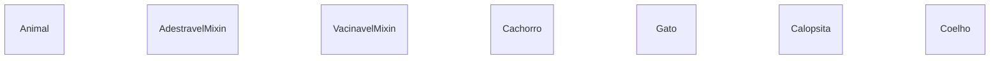
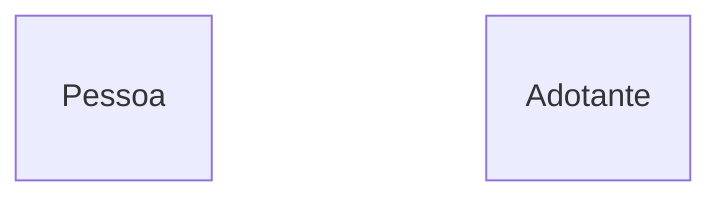
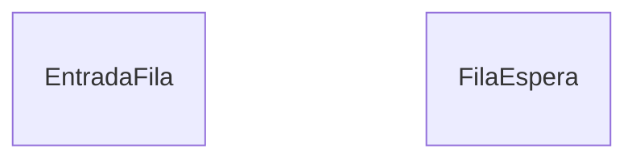
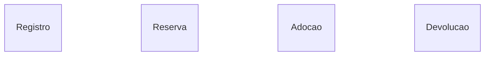
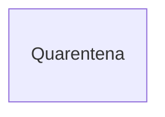
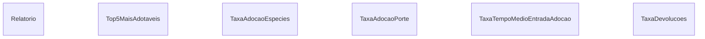
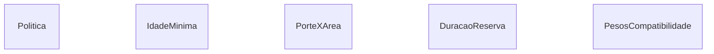
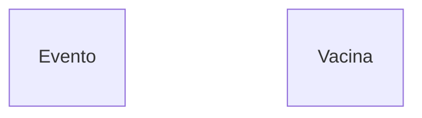

# 🐶 Gerenciamento de Adoção de pets

> **Projeto individual - Programação Orientada a Objetos (2026.2)**  
> Um sistema de gerenciamento para adoção de animais baseado em _API minimal_, permitindo realizar cadastros, triagens, reservas, adoções, geração de ralatórios, políticas configuráveis, listas de espera, cálculo de taxas e compatibilidade. Além da persistência de dados com o padrão repository, utilizando JSON e SQLite. Foi desenvolvido com o intuito de avaliar os conhecimentos adquiridos ao longo da cadeira.


## 📌 Sumário:
- [Descrição do projeto](#ℹ️-descrição-do-projeto)
- [Objetivo](#-objetivo-do-projeto)
- [Como começar - Não documentado ainda](#-como-começar)
- [Estrutura do projeto](#️-estrutura-do-projeto)
- [Classes planejadas](#-classes-planejadas)
- [Decisões de design](#-decisões-de-design)
- [Funcionalidades - Não documentado ainda](#-funcionalidades)
- [Cobertura dos testes - Não documentado ainda](#-cobertura-dos-testes)

---

<br>
<br>

## ℹ️ Descrição do projeto:
O projeto consiste no desenvolvimento de um sistema de adoção de animais baseado em _API Minimal_. Ele conta com uma arquitetura baseada em poo, onde entidades relevantes ao domínio são modeladas em classes para garantir consistência e aplicação de conhecimentos a respeito. O sistema busca simular um ambiente real de adoção de animais, com opções de cadastro, buscas, adoção, gerações de relatórios, contratos e taxas, além de várias outras funcionalidades.

### Lista de tecnologias utilizada:
1. `Swagger`;
2. `FastAPI`;
3. `Sqlite3`;
4. `pytest`;
5. `mypy`;

---

<br>
<br>

## 🎯 Objetivo do projeto:
O objetivo deste projeto é aplicar os conhecimentos adquiridos ao longo da cadeira (POO) em um sistema real. Permitindo, dessa forma, conceber uma demonstração prática de conhecimentos como `Herança`, `Polimorfismo`, `Abstração` e `Encapsulamento`, utilização de `mixins`, padrões `repository` e `strategy`, testes unitários, desenvolvimento de API's e modelagem de sistemas. Além, é claro, de consolidar uma base sólido em pragramação e desenvolvimento de sistemas.

---

<br>
<br>

## 💻 Como começar:

```
Será documentado posteriormente
```

---

<br>
<br>

## 🏗️ Estrutura do Projeto:
A estrutura adotado visa alinhar padrões de mercado aos requisitos do projeto, permitindo consolidar ainda mais a experiência em relação a desenvolvimento de projetos.

```text
📂 projeto-1-poo-sistema-adocao-animais
 ├── 📂 Data
 │    ├── database.db
 │    ├── seed.py
 │    ├── settings.json
 ├── 📂 Docs
 │    ├── decisoes-de-design.md
 │    ├── uml.md
 ├── 📂 src
 |    ├── 📂 api
 |    ├── 📂 config
 |    |    ├── settings.py 
 |    ├── 📂 domain
 |    |    ├── 📂 mixins
 |    |    ├── 📂 models
 |    |    ├── enums.py
 |    |    ├── exceptions.py
 |    ├── 📂 repositories
 |    ├── 📂 services
 |    ├── 📂 strategies
 ├── 📂 tests
 |    ├── conftest.py
 ├── .gitignore
 ├── main.py  
 ├── README.md
 ├── requirements.txt
```
---

<br>
<br>

## 💭 Classes planejadas:
Abaixo está uma representação simplificada das classes planejadas inicialmente para o desenvolvimento deste projeto.

### Para visualizar o diagrama uml desenvolvido, [click aqui](./docs/uml.md)


















---

<br>
<br>

## 🧱 Decisões de design
As decisões de design tomadas ao longo do projeto visam alinhar tanto a experiência de desenvolvimento quanto os requisitos do trabalho, visando alcançar um bom desempenho.

### [click aqui para acessar](./docs/decisoes-de-design.md)

---

<br>
<br>

## 🎮 Funcionalidades:
```
Será documentado posteriormente
```

---

<br>
<br>

## 🧩 Cobertura dos testes:
```
Será documentado posteriormente
```


