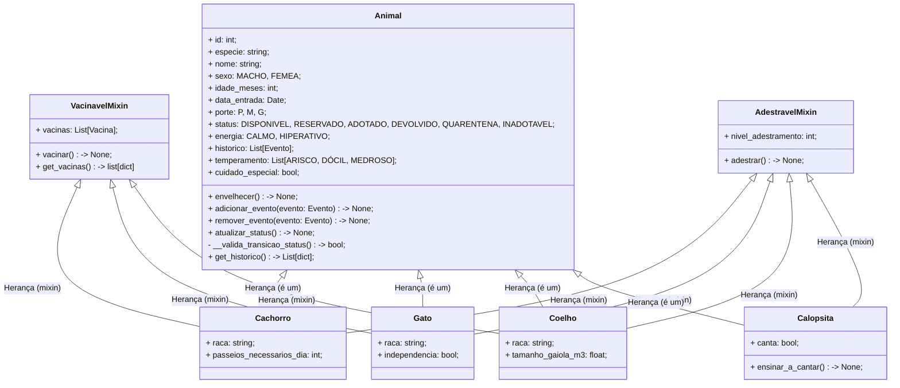
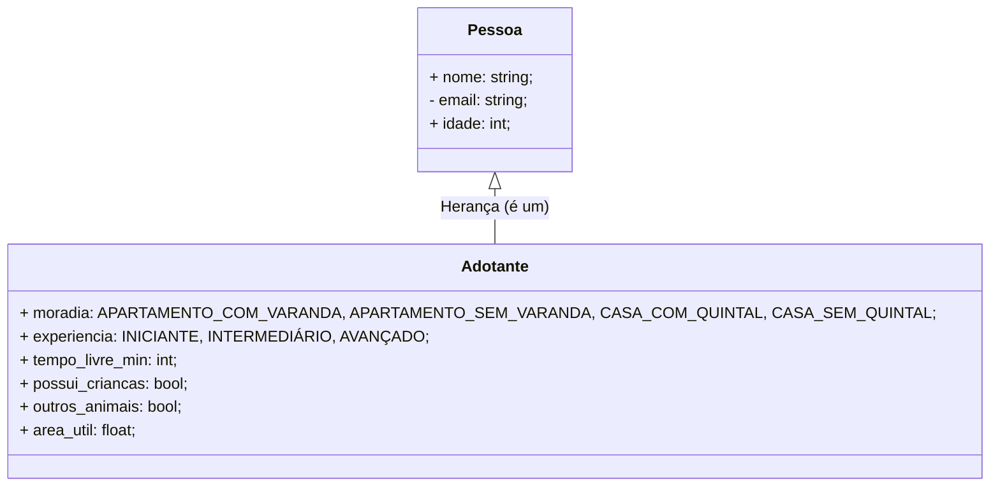
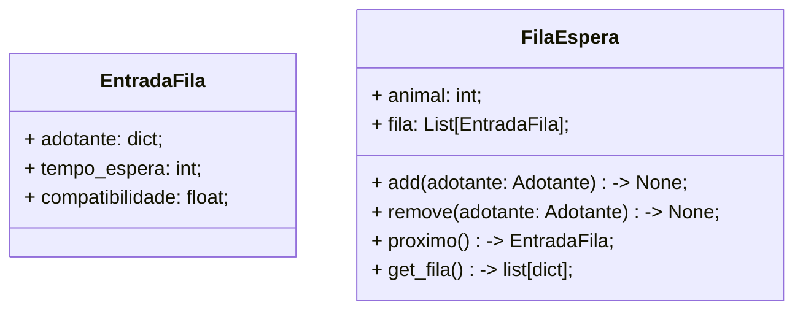
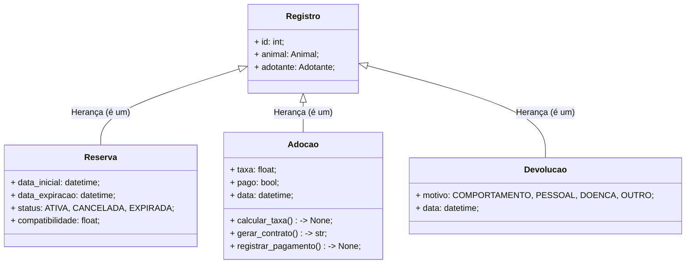
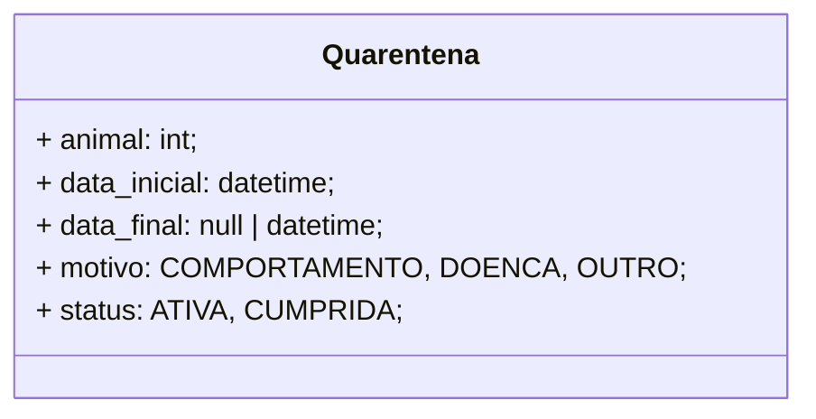
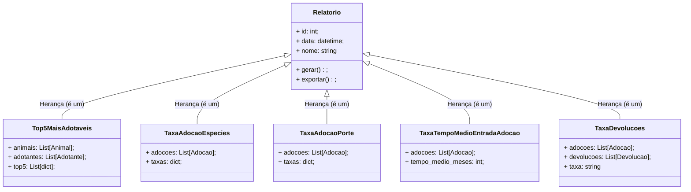
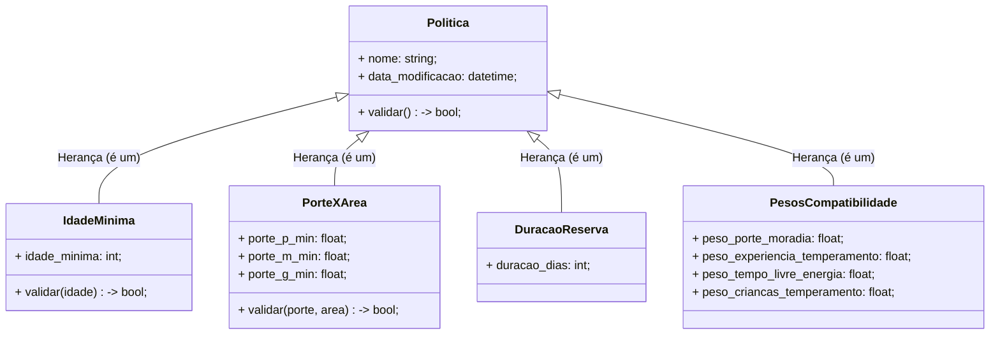
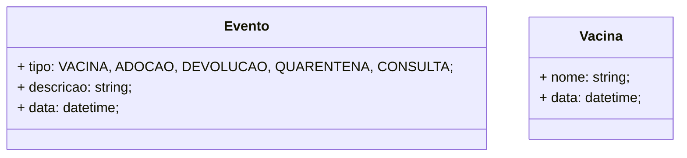

# 📄UML Textual
Aqui estão descritas as classes iniciais pensadas para o projeto, juntamente com seus `atribútos`, `métodos principais` e `relacionamentos` (herança);

Esta descrição é apenas um ponto de partida para o desenvolvimento do projeto, não necessariamente se manterá inauterada até o fim do desenvolvimento.

[Click para voltar ao readme](../README.md#-classes-planejadas)

### Sumário:
* [Animais](#animais);
* [Pessoas](#pessoa);
* [Lista de Espera](#lista-de-espera);
* [Registros](#registros);
* [Quarentena](#quarentena);
* [Relatórios](#relatorios);
* [Políticas configuráveis](#politicas-configuráveis);
* [Auxiliares](#classes-auxiliares);

 

---

### Animais:

 
 

---

### Pessoa:

 
 

---

### Lista de Espera:

 
 

---

### Registros:

 
 

---

### Quarentena:

 
 

---

### Relatorios:

 
 

---

### Politicas configuráveis:

 
 

---

### Classes auxiliares:

